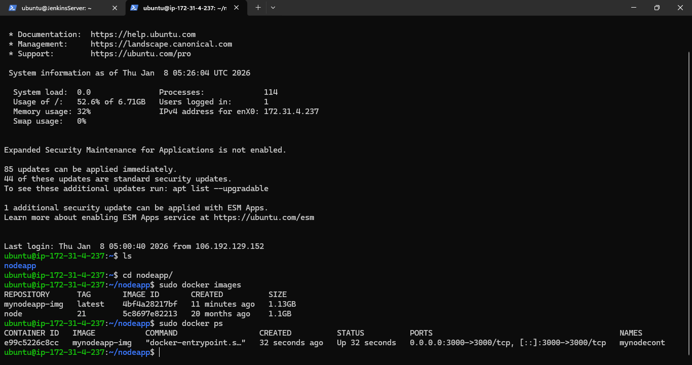
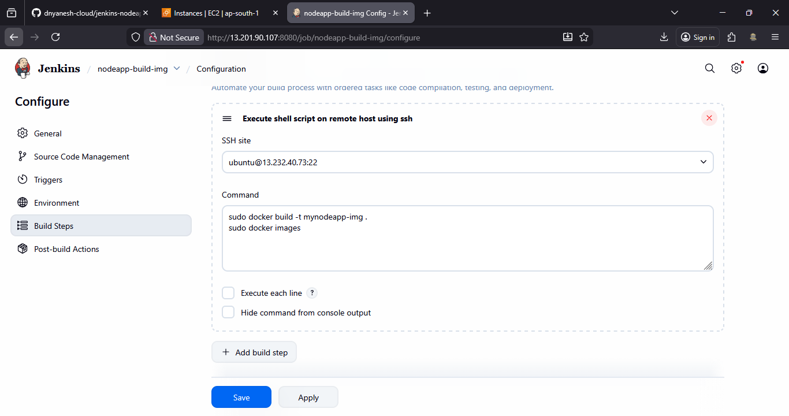
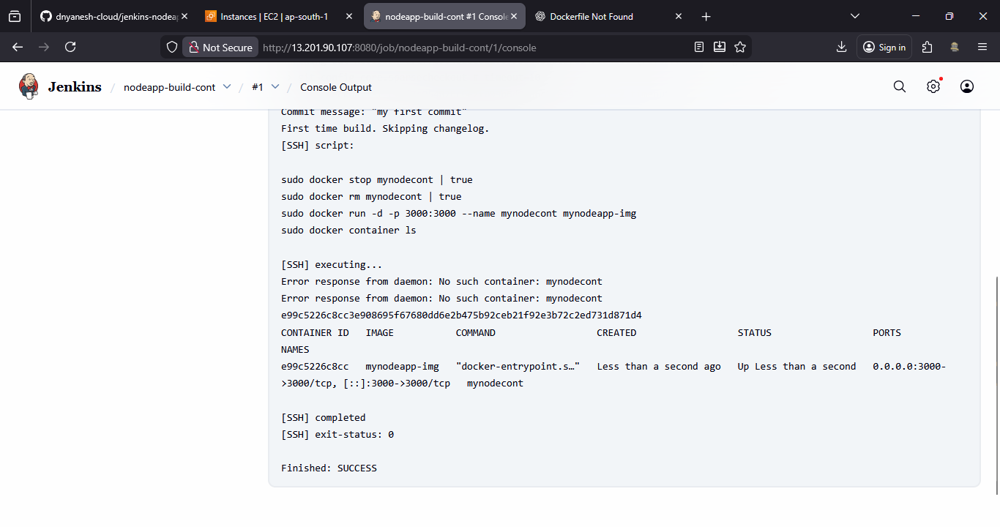
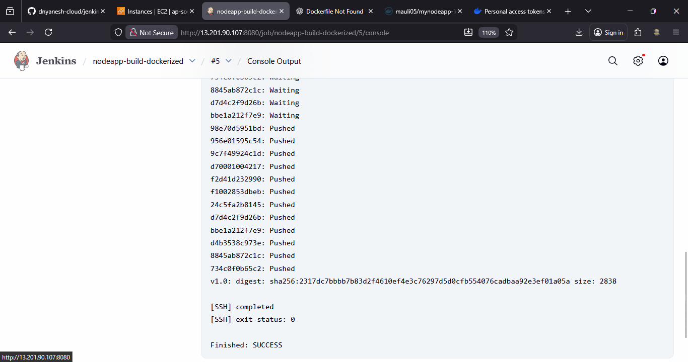
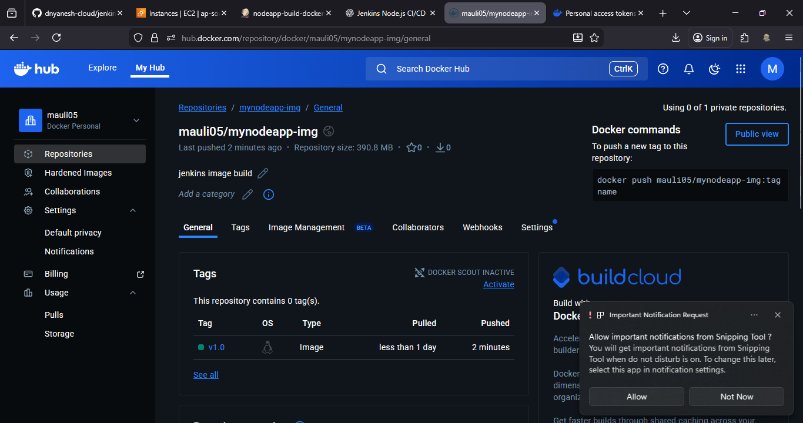

# Jenkins Project: Dockerized Node.js App – Build, Run & Push Image

This project demonstrates how to **containerize a Node.js application using Docker** and automate **image build, container run, and DockerHub push** using **Jenkins CI/CD**.

---

## Project Architecture

**Flow:**
GitHub Push → Jenkins Build Docker Image → Jenkins Run Container → Jenkins Push Image to DockerHub

---

## Prerequisites

* EC2 / Remote Server (Docker Host)
* Jenkins Server
* Docker installed on Jenkins or Remote Host
* GitHub Account
* DockerHub Account
* Security Group:
  * SSH (22)
  * Application Port (3000)

---

## Jenkins Plugin Setup (Mandatory)

Before creating Jenkins jobs, install and configure the required plugins.

### Step A: Install Required Jenkins Plugins

1. Login to **Jenkins Dashboard**
2. Go to **Manage Jenkins → Plugins**
3. Click **Available Plugins**
4. Search and install the following plugins:

   * **Git Plugin**
   * **Docker Plugin**
   * **Docker Pipeline**
   * **SSH Build Wrapper Plugin**
   * **NodeJS Plugin** (optional, if Node is required locally)
5. Select **Install without restart** (or Restart Jenkins if prompted)

---

## SSH Setup for Remote Docker Server

Jenkins uses SSH to connect to the remote server where Docker is installed.

### Step B: Add SSH Credentials in Jenkins

1. Jenkins Dashboard → **Manage Jenkins**
2. Go to **Credentials → System → Global credentials (unrestricted)**
3. Click **Add Credentials**

Fill details:

* **Kind:** SSH Username with private key
* **Username:** ubuntu
* **Private Key:** Enter directly
* Paste contents of your `key.pem` file
* **ID:** docker-ssh-key
* Description: SSH key for Docker remote server

Click **Create**

---

### Step C: Configure SSH Remote Host

1. Go to **Manage Jenkins → System Configuration**
2. Scroll to **SSH Remote Hosts** section
3. Add new SSH host:

   * **Hostname:** <REMOTE-SERVER-PUBLIC-IP>
   * **Port:** 22
   * **Credentials:** docker-ssh-key
4. Save

---

## Project 1: Build Docker Image for Node.js App Using Jenkins

### Step 1: Prepare Remote Server

```bash
mkdir nodeapp
cd nodeapp
```

### Step 2: Create Dockerfile

```bash
nano Dockerfile
```

```Dockerfile
FROM node:21
WORKDIR /usr/src/app
COPY package.json ./
RUN npm install
COPY . .
EXPOSE 3000
CMD ["node","app.js"]
```

---

### Step 3: Install Docker on Remote Server

```bash
sudo apt update -y
sudo apt install docker.io -y
sudo systemctl start docker
sudo systemctl enable docker
```

---

### Step 4: Push Source Code to GitHub

```bash
git init
git add .
git commit -m "my node app"
git branch -M master
git remote add origin <GITHUB-REPO-URL>
git push origin master
```

---

### Step 5: Setup GitHub Webhook

* GitHub → Repository → Settings → Webhooks
* Payload URL:

  ```
  http://<JENKINS-IP>:8080/github-webhook/
  ```
* Content Type: application/json
* Event: Push

---

### Step 6: Jenkins Job – Build Docker Image

**Job Name:** `nodeapp-build-img`

**Type:** Freestyle Project

#### Configuration

* Source Code Management:

  * Git Repository URL

* Build Trigger:

  * GitHub hook trigger for SCM polling

* Build Step → Execute Shell (Remote Host via SSH):

```bash
sudo docker build -t mynodeapp-img .
sudo docker images
```
> Install Docker-related plugins if required (Docker, SSH Build Wrapper)



---

## Project 2: Run Docker Container Using Jenkins

### Step 1: Create Jenkins Job

**Job Name:** `docker-img-run-nodeapp`

**Type:** Freestyle Project

#### Configuration

* Source Code Management:

  * Git Repository URL

* Build Trigger:

  * Build after other projects are built
  * Triggered by: `nodeapp-build-img`

* Build Step → Execute Shell on remote Host:

```bash
sudo docker stop mynodecont || true
sudo docker rm mynodecont || true
sudo docker run -d -p 3000:3000 --name mynodecont mynodeapp-img
sudo docker ps
```

---

### Step 2: Verify Application

Open browser:

```
http://<SERVER-IP>:3000
```

---

## Project 3: Push Docker Image to DockerHub Using Jenkins

### Step 1: Create DockerHub Repository

* DockerHub → Create Repository
* Name: `mynodeapp-img`
* Visibility: Public

> Image naming format:
> `username/repository-name:tag`

---

### Step 2: Generate DockerHub Access Token

* DockerHub → Account Settings → Security
* Generate New Token
* Save token securely

---

### Step 3: Jenkins Job – Push Docker Image

**Job Name:** `docker-image-push`

**Type:** Freestyle Project

#### Configuration

* Build Trigger:

  * Build after other projects are built
  * Triggered by: `docker-img-run-nodeapp`

* Build Step → Execute Shell on remote host:

```bash
sudo docker login -u <DOCKERHUB-USERNAME> -p <DOCKERHUB-TOKEN>
sudo docker tag mynodeapp-img <DOCKERHUB-USERNAME>/mynodeapp-img:v1.0
sudo docker push <DOCKERHUB-USERNAME>/mynodeapp-img:v1.0
```

---

### Step 4: Verify Image on DockerHub

* Login to DockerHub
* Verify pushed image and tag

---

